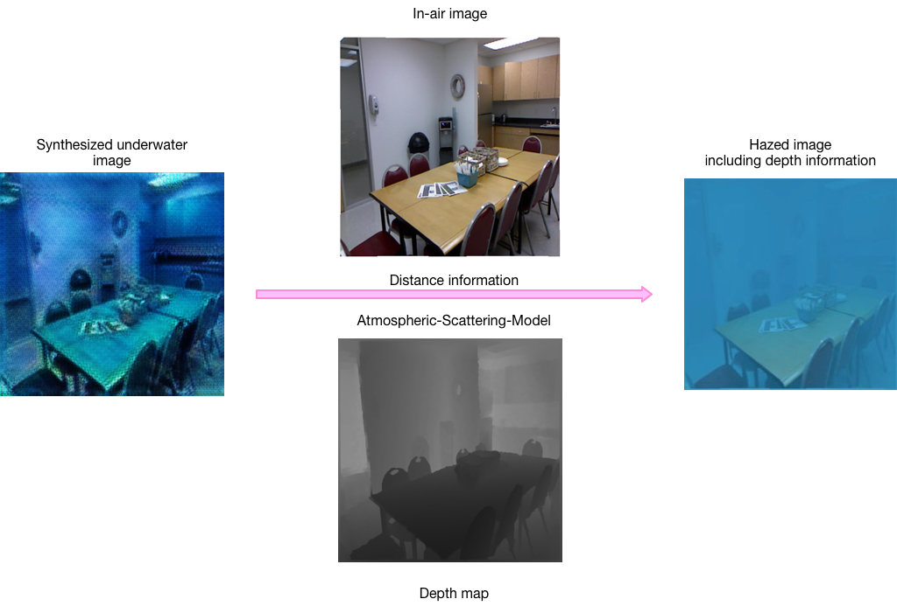

# Atmospheric-scattering-model
Input: a in-air image and related depth map and synthesized underwater image.
Output: the synthesized image haze image about water scattering coefficient.
Principle: Atmospheric-scattering-model

Here is an example:

